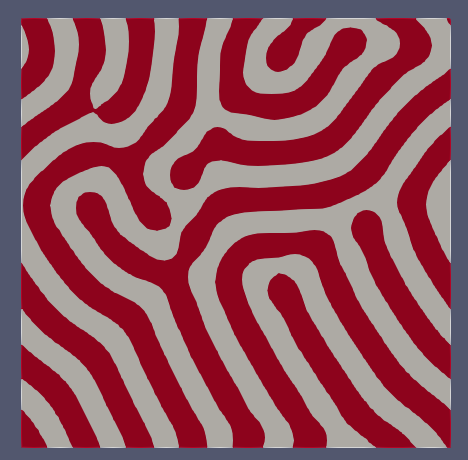

# Turing Instability
la repo è costituita da due script principalmente:
+ Il codice ```MixedWF_CH.ipynb``` in cui viene approcciato il problema non lineare $(1)$, con risultati non adatti
+ Il codice  ```TN.ipynb``` in cui viene approcciato un problema simile ma omogeneo $(2)$, i risultati sembrano ok
+ Plot delle concentrazioni $u,v$ in ```FreeFEM```
## MixedWF_CH.ipynb
Advection-Diffusion Eq

$$\begin{cases} u_t-\varDelta u=f(u,v)\\ 
              v_t -d\varDelta v =g(u,v) \qquad(1)\\ 
              u(x,y,z)=u_0(x,y)\\ 
              v(x,y,z)=v_0(x,y)\\ 
              + \text{Neuman BC}\\
              +\text{Periodic BC} 
\end{cases}$$

dove i termini non lineari sono:

$$\begin{align}
              f(u,v)&=u-\alpha v +\gamma u v - u^3\\ 
              g(u,v)&= u-\beta v
\end{align}$$

and
$u_0(x,y),v_0(x,y)$ sono numeri randomici. $\beta, \thinspace d, \thinspace \alpha,\thinspace \gamma$ sono costanti, il risultato:

<p align="center" width="100%">
    
</p>

## TN.ipynb
$$\begin{cases}
\frac{\partial X}{\partial t}=a(X-h)+b(Y-k)+\mu \nabla^2 X \qquad (2)\\\\
\frac{\partial X}{\partial t}=c(X-h)+d(Y-k)+\nu \nabla^2 Y\\
+\text{Periodic BC}
\end{cases}$$

la cui Forma debole ([pagina 9](https://www.diva-portal.org/smash/get/diva2:1780187/FULLTEXT01.pdf))
```math
\begin{align}
\int_{\Omega} (X^{n+1}-X^n)v+\mu \Delta t \nabla X^{n+1}\nabla v- \Delta t(aX^{n+1}+bY^{n+1})v\thinspace d\Omega &=0\\
\int_{\Omega} (Y^{n+1}-Y^n)v+\nu \Delta t \nabla Y^{n+1}\nabla v- \Delta t(cX^{n+1}+dY^{n+1})v\thinspace d\Omega &=0
\end{align}
```

la soluzione che ho ottenuto:
<p align="center" width="100%">
    
</p>

## FreeFEM
plot ottenuto attraverso il codice FreeFEM

<p align="center" width="100%">
    
</p>
